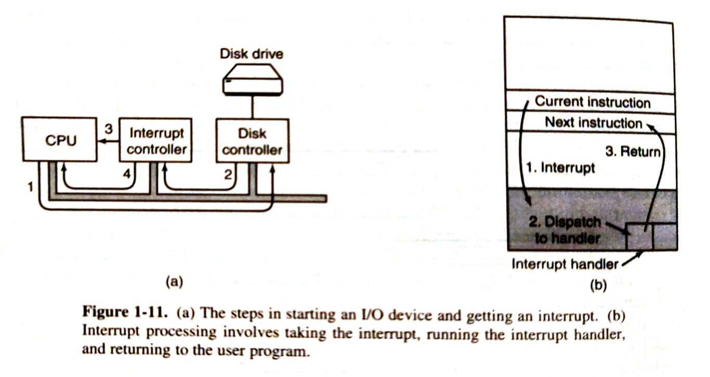
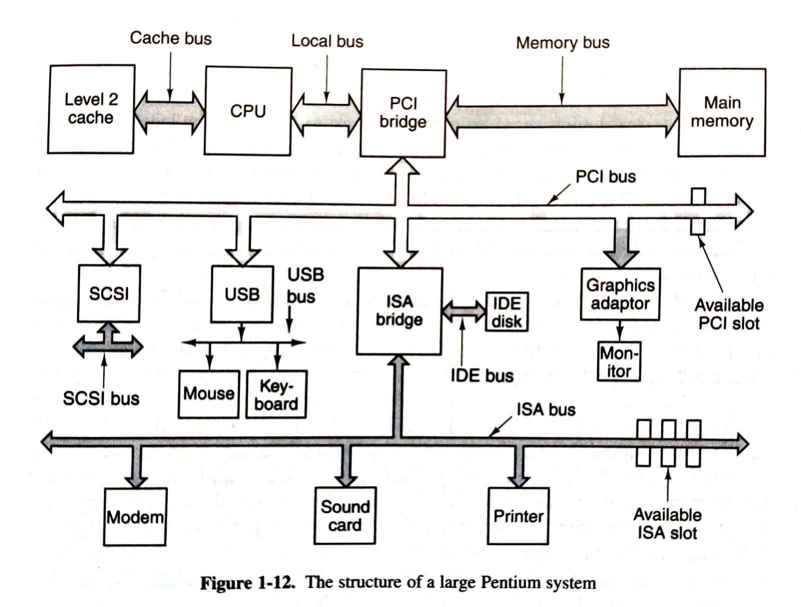
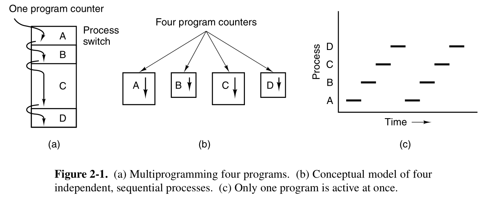
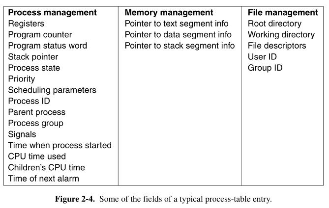

Modern Operating Systems, 3rd Edition

# Introduction

## What is an OS?

Es pot veure al OS de dues maneres diferents, ja que aquestes són les seves dues tasques principals.

- Com una capa d'abstracció entre el hardware i els programadors
- Com un gestor de recursos, amb eines com la multiplexió

## Computer Hardware Review

### Processors

Conceptes importants:

- Instruction Set
- Registres
  - Program Counter (PC)
  - Stack Pointer
  - Program Status Word (PSW): Bits de control, entre ells el que determina kernelmode o usermode (no accés a IO, memòria i PSW)

També hi ha múltiples optimitzacions:

- Pipelining permet optimització al aprofitar millor els element de l'arquitectura, però és complicat ja que s'ha de garantir l'ordre correcte d'operacions
- Multithreading permet "apartar" les instruccions en espera més lentes (accés a memòria) per poder-ne fer d'altres de mentres. No és realment paralelisme, ja que es segueix executant una sola instrucció en cada moment.

### Memory

Organitzada per capes, de més ràpida, petita i costosa a menys:

- Registres
- Caches
- Main Mem (RAM)
- Discs Magnètics
- Tapes

La funcionalitat de les cachés és minimitzar accessos a memòria, ja que és massa lenta. S'organitza en jerarquies/nivells, on nivell inferior implica més ràpida i menor capacitat. El processador determina el que va a la cache.

Un sistema de caching es defineix per les següents directives:

- On posar els nous elements a la cache
- En quina cache line posar els nous elements
- Quins elements treure de la cache per fer espai
- Os posar els elements desterrats en memòria

Els nivells de cache estan una mica generalitzats (tot i que informació antiquada):

- L1 (16KB, no delay): Dos caches, una per instruccions decodificades i l'altra per words molt utilitzats
- L2 (ordre MB, 1-2 cicles de delay)

La cache pot ser compartida entre cores o separada, cada sistema amb els seus avantages i inconveninents en l'implementació.

Altres memòries rares inclouen la CMOS, que s'utilitza per exemple en les dades de la BIOS.

### Disk

Sense entrar molt amb HW, hi ha certa terminologia important a l'hora de parlar de HDDs: arm position, track, cylinder, surface, sector...

MMU (Memory Managment Unit): Part de la CPU necessària per tenir memòria virtual.

- Permet utilitzar el disc si la main memory no és suficient. Llavors la main fa el paper de cache i el disc el paper de main.
- Gestiona el moviment d'adreces entre la main i el disc

### I/O Devices

Els dispositius externs sovint tenen un controlador que amaga la complexitat del HW al SO, oferint-li en el seu lloc una API més simple i (sol estar) estandaritzada.

Per comunicar-se amb el controlador, el SO utilitza un driver (procés que corre en kernel-mode per accedir a instruccions IN/OUT) i que sovint necessita un restart per iniciar.

(SO <-> Driver) <-> (Controller <-> Dispositiu), on (1) està al host i (2) al dispositiu extern

I/O Port Space: Registres del controlador accessibles des del driver per la comunicació

Hi ha 3 mètodes per fer la I/O:

- Busy Waiting (El més simple, lliga a la CPU a esperar la resposta): Simplement loopeja esperant la resposta.
- Interrupcions (permet a la CPU fer altres coses): Quan el driver acaba, fa una interrupció i es gestiona la resposta.
- DMA Chips (no requereixen interrupcions, però si HW específic): Un chip específic s'ocupa de tot (la CPU indica prèviament el que ha de fer) i avisa (amb interrupció) a la CPU quan el procés ha acabat.

Repàs d'interrupcions (figura inferior):

1. El driver assigna la tasca al controlador
2. Un cop acabada, el controlador passa la interrupció a l'interrupcion controller
3. El interruption controller avisa a la CPU que ha rebut l'interrupció
4. Si la CPU l'accepta, s'envia la interrupció a la CPU
   Per evitar solapament d'interrupts, la CPU pot deshabilitar l'acceptació d'aquests. Llavors s'acumularan al interrupt controller, que decidirà quina deixa passar primer.

### Busos

Amb ordenadors més complexos, un sol bus de dades no és suficient. Per exemple així estan estructurats els busos amb un sistema Pentium:

Entre els busos destaquen els estandaritzats:

- IDE: Discs, CD-ROMs. En general I/O "ràpids"
- USB: Dispositius I/O "lents"

També hi ha el sistema Plug and Play: En comptes de que els dispositius decideixin quin és el seu codi d'interrupció (configurable en un DIP switch per exemple), ho decideix el SO i li diu al dispositiu al connectar-se.

Evita els solapaments en els codis d'interrupció. Els dispositius que no compten amb aquesta tecnologia es diuen legacy.

### Booting

Al obrir el PC s'obre la BIOS, que fa el següent:

1. Mira RAM, teclat, pantalla...
2. Escaneja els busos ISA i PCI per mirar els dispositius iniciats, tant legacy com plug and play. Si cal, els configura.

El device (normalment HDD) que es vol utilitzar pel boot ha de tenir la següent estructura:

1. 1r sector defineix la taula de particions
2. La primera partició té un bootloader que carrega el SO
3. El SO demana a la BIOS els dispositius connectats i carrega drivers
4. Quan estan preparats, es carrega el kernel.

## Tipus de SO

Els SO es poden classificar de "majors" a "menors" d'una forma similar a aquesta:

- Mainframe OS: Data Centers, habitacions senceres (milions d'usuaris)
- Server OS: Nivell inferior a Mainframe (milers d'usuaris)
- Multiprocessor OS: De server petits a ordenadors personals
- PC OS: Personal Computers
- Handheld Computer: Mòbils
- Embedded OS: TV, etc (no corren codi extern)
- Sensor Node OS: Xarxa de sensors, low power i funciona sense tots els dispositius (TinyOS)
- Smart Card OS: Targetes, poden córrer fins i tot Java (tenen el JVM compilat)

## OS Concepts

### Processes

Realment és una abstacció del que funciona realment. Ho definim com un programa en execució. La seva informació es registra en la taula de processos. Cada procés té certes dades associades:

- Espai en memòria (memòria virtualitzada)
- Valors dels registres
- Altres dades importants

### Adress spaces

Cada procés té la seva memòria virtual que demana al SO i que pot ser superior a la RAM. En tal cas el SO s'ocupa de la virtualització (swapping).

### Files

File Hierarchy: Abracció dels fitxers en forma d'arbres, per amagar les dificultat de gestionar els discos.

Cada procés es troba en un working directory, que pot canviar amb una crida a sistema. Abans de llegir i escriure, s'obre el fitxer amb una systemcall. Aquesta dona un file id o bé un error code.

Muntar és simplement unir la jerarquia de fitxers d'un dispositiu a la jerarquia principal, ja que UNIX sols considera paths en l'arbre principal /. Els dispositiu s'accedeixen a partir dels special files, que no són fitxers com a tal sinó referències als dspositius.

Un altre fitxer fora del comú són les pipes, que són similars als fitxers i serveixen per gestionar la comunicació entre programes.

### Protection

Els fitxers són accessibles segons indica els rwx bits, separats en owner, group del owner i altres.

### Shell

No forma part del SO, les comandes s'executen com a processos fills. En cas de posar &, es segueix una metodologia concurrent en comptes de secuencial.

## System Calls

Una crida a sistema és com una crida a qualsevol altre procediment, però en la qual s'entra en kernel mode. A més, no es salta a una adreça qualsevol, sinó a una especialment definida.

POSIX defineix les system-calls que tot sistema ha d'implementar, però els SO poden implementar sols les fonamentals i delegar les altres a llibreries que les utilitzen.

### Process Managment

- Fork: Crea un procés (fill) idèntic a l'actual (pare). Retorna 0 al fill i el PID del fill al pare.
- Waitpid: Espera a que un fill acabi i el mata. Té opcions per controlar exactament quin fill i per recuperar el exit-code del fill
- Execve: Canvia la core image del procés a la del binari indicat. Rep el binari a executar, l'array de paràmetres i array d'entorn.
- Exit: Retorna un valor [0,255] i acaba el procés.

La memòria d'un programa està dividida en tres segments. Al principi i ha el text i després del dades que s'expandeixen cap a baix. Al final hi ha el stack que s'expandeix cap amunt. Es caracteritza de la següent forma:

- Text es manté al espai inicial
- Stack pren més memòria sense problema
- Data pren més memòria amb una syscall

### File Managment

Crides per a fitxers (individuals):

- open: Clona un "file descriptor" per treballar amb el fitxer donat, indicant el codi que interessi de: O_RDONLY, O_WRONLY, O_RDWR, O_CREAT.
- close: Tanca el fitxer amb el file descriptor donat.
- read/write: Llegeix/escriu al contingut del file descriptor donat, per defecte seqüencialment (des del principi del fitxer al final)
- lseek: Canvia la posició del punter del fitxer a un d'arbitrari donat.
- stat: Mostra metadades del fitxer. fstat fa el mateix per a fitxers ja oberts.

### Directory managment

- mkdir, rmdir, lin, unlink, mount umount

Com funcionen els fitxers i directoris a UNIX:

- Cada fitxer té un i-number que l'identifica únicament.
- Hi ha una taula amb els i-number, propietari i posició al disc per a cada fitxer
- Un directori no és res més que un diccionari amb el i-number com a clau i el ASCCI name com a valor.

### Miscellaneous

- chdir: Canvia el cwd
- chmod: Canvia permisos
- kill: Envia una senyal a un procés
- time: Dona el temps actual

## OS Structure

### Monolithic Systems

- Tots els processos penjen d'un procés comú
- Cada procés por crear processos fills
- Una crida de sistema es divideix en 3 nivells:
  1. Un procés principal que demana el servei
  2. Uns processos de servei que criden al sistema
  3. Una processos d'utilitat que utilitzen els processos de servei

### Layered Systems

- Diferents capes, de més "fonamentals" (amb més privilegis) a menys.
- Les capes superiors demanen utilitats a les inferiors, qui treballen per oferir una API clara a les capes superiors.
- També es pot pensar com corones concèntriques de més a menys privilegis.

### Microkernel

- Tenen una part mínima corrent en kernel-mode. La resta corre en usuari
- Al separar els components, evita bugs fatals en cas d'errors.
- MINIX: open-source, molt petit. Els processos estan ordenats simultaneament amb un layer system per fer abstraccions (com per l'accés al disc).
- Drivers per exemple sols accedeixen a allò que els hi correspon, no poden accedir a la resta.

### Client-server

- Separa els processos del server i els processos del client, es comuniquen a partir de missatges.
- Model utilitzat en els protocols web, a nivell conceptual
- El server pot estar en local o dividit en una xarxa

### VMs

- Per exemple Z/VM (actualment millor KVM)
- Conceptes com Hypervisor (al final no és res més que el VM monitor), etc.
- Ventatges:
  - Independència en cas de crash en una de les màquines.
  - Permet shared HW en una web sense shared SW
- Es necessita CPU Virtualitzable: CPU que permet executar kernel-mode des del SO intern (sense ser ignorat)
- També es pot fer un Type 2 hypervisor, un altre SO al host amb altres coses. Com es fa amb docker.

### Exokernel

- Com un VM però donant accés directe als recursos particionant-los
- Es perd el dinamisme però es guanya eficiència i simplicitat.

# Processes and Threads

## Processes

A process is an abstraction that represents a running program.

### The Process Model

The following diagram offers a great visualization to understand multiprogramming:

Important difference between program and process:

- Program: The code, an algorism that is used to perform a task
- Process: Abstract idea that represents the activity of doing such task

### Process Creation

- **Daemon**: A process running in the background

The *fork* syscall creates is an exact (except for minor details) copy of the parent. It can later become another program by using the *exec* syscall.

### Process Termination

Different types of termination:

- Normal exit
- Error exit
- Fatal error
- Killed

The first two are voluntary, and correspond to the *exit* syscall. The last two are not voluntary, and are produced by a signal sent from the OS or another program, respectively.

### Process Hierarchies

- **Process group**: Set of processes formed by a process and all of its descendants.

The *kill* syscall allows to send signals to an individual process or to its process group.

On startup, the *init* process (PID 1) has as many children as terminals. Then login is performed in one of them, a shell is started (and maybe afterwords an X session, etc).

### Process States

> Concepts from this section were already familiar from the OS subject

The *block* state allows us to think about syscalls as nothing more that other processes that are normally blocked and, when signaled, they perform a certain task and, when finished, the user process returns to ready. This is not real (as syscalls are called by interruptions, not signals), but is an abstraction that resembles the Microkernel OSs.

### Implementation of Processes

The OS keeps a *Process Table* containing all the control information about the running processes. The following figure shows the contents of each entry of this table:

### Modeling Multiprogramming

Multiprogramming allows for a better use of CPU, as when processes are waiting for I/O, the CPU can keep working on other processes instead of waiting.

As more processes are involved (and less dependant of I/O), more work will be outputed by the CPU. This phenomemon causes, for example, that a faster memory may also increase the CPU effective speed, as more processes can be running instead of waiting for I/O.
